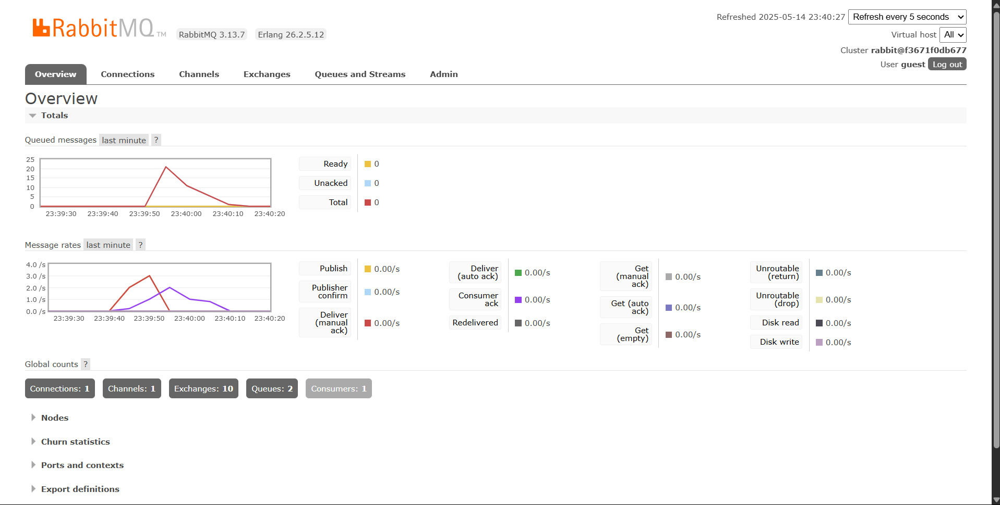

Pascal Hafidz Fajri

230622746

## Apa itu amqp?

AMQP (Advanced Message Queuing Protocol) adalah protokol standar terbuka untuk pertukaran pesan antara aplikasi atau komponen sistem. Protokol ini mendefinisikan cara sistem mengirim dan menerima pesan, memastikan operabilitas antara berbagai platform.

## Maksud dari `guest:guest@localhost:5672`

`guest` pertama dan kedua secara berturut-turut adalah Username dan Password untuk mengakses RabbitMQ, sedangkan `localhost` pada `localhost:5672` adalah hostname server yang digunakan (pada kasus ini adalah perangkat lokal sendiri), dan `5672` adalah port default yang digunakan untuk membuat koneksi.

## Simulation slow subscriber

Terjadi akumulasi 20 pesan dalam antrian (queue) yang terlihat pada gambar, menunjukkan adanya disparitas kecepatan pemrosesan dalam sistem. Faktor utama penyebabnya adalah waktu pemrosesan subscriber yang secara signifikan lebih lambat dibandingkan laju pengiriman publisher. Simulasi ini memberikan fenomena yang sering terjadi pada lapangan yang mana terdapat indikasi ketidaksesuaian antara kapasitas produksi dan konsumsi dalam arsitektur message broker yang ada.

## Running at least three subscribers

Gambar pertama mengungkapkan peningkatan signifikan dalam kecepatan konsumsi queue, diakibatkan oleh adanya tiga subscriber yang beroperasi secara paralel untuk mengambil pesan. Konfigurasi ini menghasilkan penurunan drastis pada volume pesan yang tertahan dalam queue.

Pada observasi gambar kedua, teridentifikasi kemampuan optimal message broker dalam:

- Melakukan distribusi beban (load balancing) secara efektif
- Mengalokasikan pesan ke masing-masing consumer dengan proporsi seimbang
- Memastikan mekanisme deletion policy berjalan tepat dimana pesan yang telah diproses otomatis terhapus dari queue